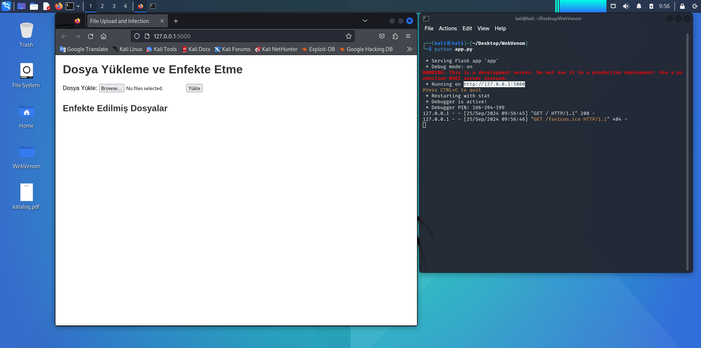
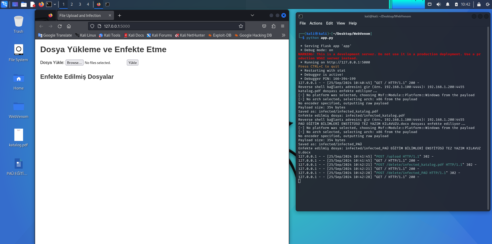

# WebVenom

A project that adds malware to office and pdf files over the web.

This project consists of two versions;

1- WebVenom Console Application
2- WebVenom Web Application


# WebVenom Console Application

This project is a Python script that uses `msfvenom` to infect files in the `upload` directory and saves the infected files in the `infected` directory. The script can either take a reverse shell address from the user or read it from a `config.fkn` file if available.

## Project Structure

```
msfvenom_infector_project/
    ├── infector.py          # The main Python script
    ├── config.fkn           # (Optional) File for reverse shell configuration
    ├── README.md            # Documentation of the project
    ├── upload/              # Directory where files to be infected are placed
    └── infected/            # Directory where infected files are saved
```

## Features

- **Infect files**: The script uses `msfvenom` to generate a payload and infect files located in the `upload` directory.
- **Customizable reverse shell**: You can provide the reverse shell IP and port via a `config.fkn` file, or the script will prompt you for the values.
- **Automatic infected file management**: Infected files are automatically saved in the `infected` directory with a prefixed filename.

## Requirements

- **Kali Linux**: This script is designed to run on Kali Linux.
- **Python 3.x**: The script is written in Python 3.
- **Metasploit Framework**: Required to use the `msfvenom` command.

### Installation on Kali Linux

If you haven't already installed Python 3 or Metasploit, you can install them using the following commands:

```bash
sudo apt-get update
sudo apt-get install python3
sudo apt-get install metasploit-framework
```

## Usage

1. **Prepare the `upload` directory**:
   Place the files you want to infect into the `upload/` directory. You can create the directory with the following command if it doesn't exist:
   ```bash
   mkdir upload
   ```

2. **Set the reverse shell address**:
   You can either:
   - Create a `config.fkn` file with the reverse shell IP and port in the format `LHOST:LPORT`.
   - OR, the script will prompt you to enter the reverse shell address manually.

3. **Run the Python script**:
   To run the script, simply use:
   ```bash
   python3 infector.py
   ```

4. **Check the `infected` directory**:
   The infected files will be saved in the `infected/` directory, which is created automatically if it doesn't exist.

## Example

To infect files using a reverse shell with IP `192.168.1.100` and port `4444`, create a `config.fkn` file with the following content:

```
192.168.1.100:4444
```

Then, simply run:

```bash
python3 infector.py
```

Infected files will be saved in the `infected` directory with the filename prefix `infected_`.

## Notes

- Ensure that `msfvenom` is correctly installed and configured on your system.
- Modify the payload type in the script if you want to infect non-Windows files or use different `msfvenom` options.


# WebVenom Web Application

WebVenom Web Application is a Flask-based web application designed to allow users to upload files and infect them with malicious payloads using msfvenom. This project integrates Python and msfvenom to provide a simple interface for file uploading, infection, and downloading of the infected files.

## Features

- Upload files through a user-friendly web interface.
- Infect files using msfvenom.
- Provide infected file download links to users.
- Delete infected files from the server.


## Setup

 To get the project running on your local machine, follow these steps:

 ## Prerequisites

 Ensure that Python 3.x and msfvenom are installed on your system.


 You need to have Flask installed. You can install it via pip:

    ```bash
    pip install flask
    ```

## Installation

1. Clone the project and run the `app.py` file:

    ```bash
    git clone https://github.com/istec-iuc/WebVenom.git
    cd WebVenom
    python app.py
    ```

2. Open your web browser and navigate to `http://127.0.0.1:5000`.

## Usage

1. On the homepage, click the file upload button.
2. Select a file and click "Upload."
3. Return to the terminal and enter the reverse shell address.
4. Once the file is infected using msfvenom, you can download the infected file.

## Project Structure

```bash
WebVenom/
├── app.py                # Flask application
├── upload/               # Uploaded files
├── infected/             # Infected files
└── templates/            # HTML templates
    └── upload.html       # Homepage HTML template
└── screenshots/          # Screenshots for documentation
    ```

## Screenshots





