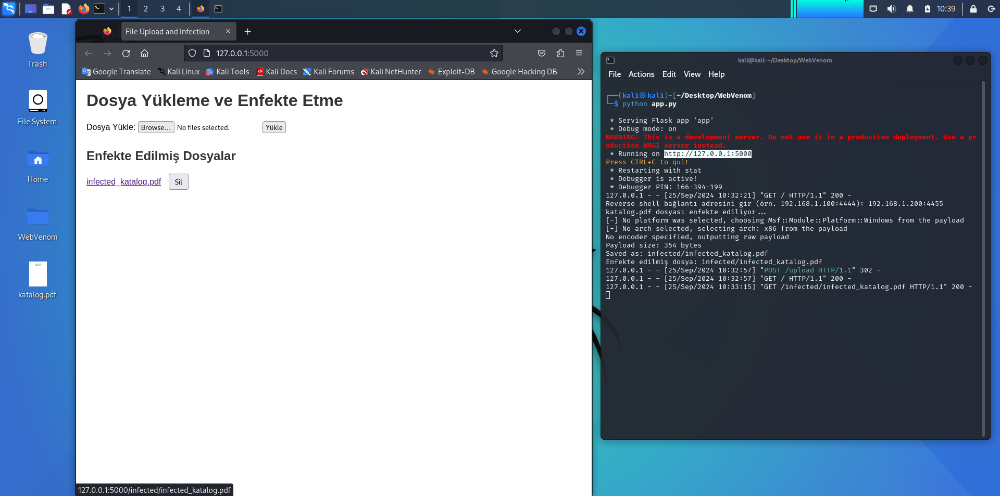

# WebVenom

WebVenom is a Flask-based web application designed to allow users to upload files and infect them with malicious payloads using msfvenom. This project integrates Python and msfvenom to provide a simple interface for file uploading, infection, and downloading of the infected files.

## Features

- Upload files through a user-friendly web interface.
- Infect files using msfvenom.
- Provide infected file download links to users.
- Delete infected files from the server.


## Setup

 To get the project running on your local machine, follow these steps:

 ## Prerequisites

 Ensure that Python 3.x and msfvenom are installed on your system.


 You need to have Flask installed. You can install it via pip:

    ```bash
    pip install flask
    ```

## Installation

1. Clone the project and run the `app.py` file:

    ```bash
    git clone https://github.com/istec-iuc/WebVenom.git
    cd WebVenom
    python app.py
    ```

2. Open your web browser and navigate to `http://127.0.0.1:5000`.

## Usage

1. On the homepage, click the file upload button.
2. Select a file and click "Upload."
3. Return to the terminal and enter the reverse shell address.
4. Once the file is infected using msfvenom, you can download the infected file.

## Project Structure

```bash
WebVenom/
├── app.py                # Flask application
├── upload/               # Uploaded files
├── infected/             # Infected files
└── templates/            # HTML templates
    └── upload.html       # Homepage HTML template
└── screenshots/          # Screenshots for documentation
    ```

## Screenshots





